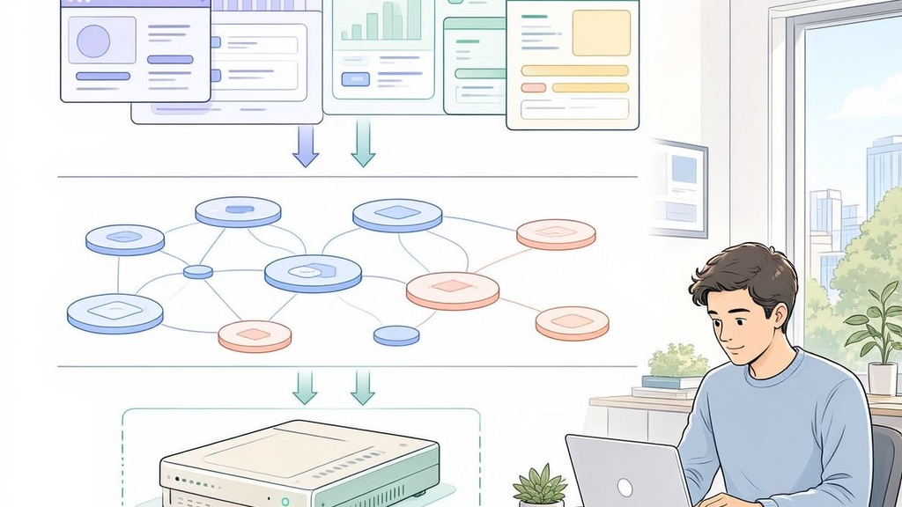
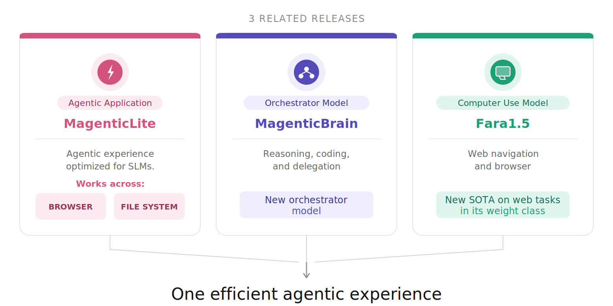

# Building a local-first Magentic UI in .NET (Blazor + Local LLMs + Aspire)

Repository links:

- ElBruno.MagenticUI: https://github.com/elbruno/ElBruno.MagenticUI
- ElBruno.LocalLLMs: https://github.com/elbruno/ElBruno.LocalLLMs
- Original Magentic UI (Microsoft): https://github.com/microsoft/magentic-ui

## TL;DR

- This sample brings Magentic-style multi-agent workflows to **pure .NET** with Blazor Server.
- It uses **local ONNX inference** through ElBruno.LocalLLMs (no cloud dependency required).
- It combines **MagenticBrain** (reasoning/delegation) and **Fara 1.5** (computer-use/vision scenarios).
- It is orchestrated with **Aspire**, so you get service orchestration plus traces/GenAI traces out of the box.

If you are a .NET developer and want to build a real multi-agent UX without moving to Python stacks, this sample is for you.

`ElBruno.MagenticUI` is a Blazor Server port inspired by [microsoft/magentic-ui](https://github.com/microsoft/magentic-ui), powered by local inference via [ElBruno.LocalLLMs](https://github.com/elbruno/ElBruno.LocalLLMs), and orchestrated by Aspire.



## Why this sample matters

- **It brings Microsoft Research ideas into .NET practice:** this app is inspired by the MagenticLite direction and maps it into a Blazor + C# implementation.
- **Purpose-built model collaboration:** MagenticBrain handles reasoning, delegation, and terminal-oriented tasks, while Fara 1.5 focuses on computer-use/browser tasks.
- **System-level design over single-model assumptions:** the three parts (orchestrator + MagenticBrain + Fara 1.5) are intended to work as one coordinated system.
- **Local-first and efficient:** the result is an agentic experience that can run on user hardware, keep data local, and support broad task coverage with smaller models.
- **Research bet validated in code:** strong agent behavior comes from tool orchestration and action loops, not knowledge alone, enabling practical capability at lower cost.
- **Operational visibility with Aspire:** the solution is orchestrated with Aspire, including distributed traces and GenAI traces in the dashboard.

## Explaining the model stack (MagenticLite, MagenticBrain, Fara 1.5)

To understand how the model family fits together, use this reference visual from the original Microsoft Research article:

[MagenticLite, MagenticBrain, Fara1.5: An agentic experience optimized for small models - Microsoft Research](https://www.microsoft.com/en-us/research/blog/magenticlite-magenticbrain-fara1-5-an-agentic-experience-optimized-for-small-models/)



## C# sample: MagenticBrain with ElBruno.LocalLLMs

```csharp
using ElBruno.LocalLLMs;
using Microsoft.Extensions.AI;

var options = new LocalLLMsOptions
{
    Model = KnownModels.MagenticBrain,
    EnsureModelDownloaded = true,
    ExecutionProvider = ExecutionProvider.Cpu
};

await using var client = await LocalChatClient.CreateAsync(options);

var response = await client.GetResponseAsync(
[
    new(ChatRole.User, "Summarize the architecture of this repository in 3 bullet points.")
]);

Console.WriteLine(response.Text);
```

## C# sample: Fara 1.5 with ElBruno.LocalLLMs

```csharp
using ElBruno.LocalLLMs;
using Microsoft.Extensions.AI;

var options = new LocalLLMsOptions
{
    Model = KnownModels.Fara15_9B,
    ModelPath = @".\models\fara-onnx-int4",
    MaxSequenceLength = 4096,
    Temperature = 0.1f
};

await using var client = new LocalVisionChatClient(options);

var messages = new List<ChatMessage>
{
    new(ChatRole.User, "Describe what is happening in this screenshot.")
};

var vision = new VisionChatOptions
{
    ImagePaths = [@".\sample-ui.png"]
};

await foreach (var token in client.GetStreamingResponseAsync(messages, vision))
{
    Console.Write(token.Text);
}
```

## Aspire orchestration and observability

The full solution is orchestrated with Aspire (`ElBruno.MagenticUI.AppHost`), which gives you:

- service discovery and wiring for the app projects
- centralized app lifecycle and environment orchestration
- distributed traces and GenAI traces in the Aspire dashboard

## Quick start

From repo root:

```bash
aspire start
```

## Final note

This sample gives .NET developers a practical path to build and run local-first agentic experiences with C#, Blazor Server, ElBruno.LocalLLMs, and Aspire.
