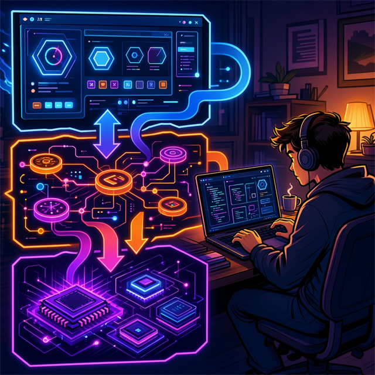
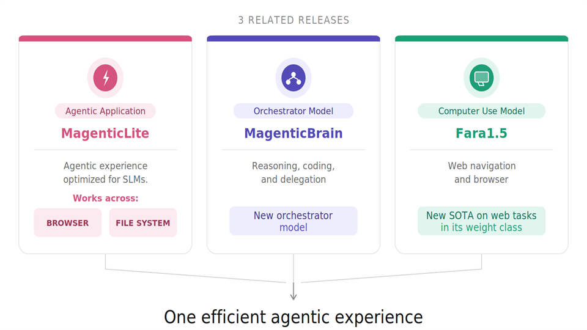
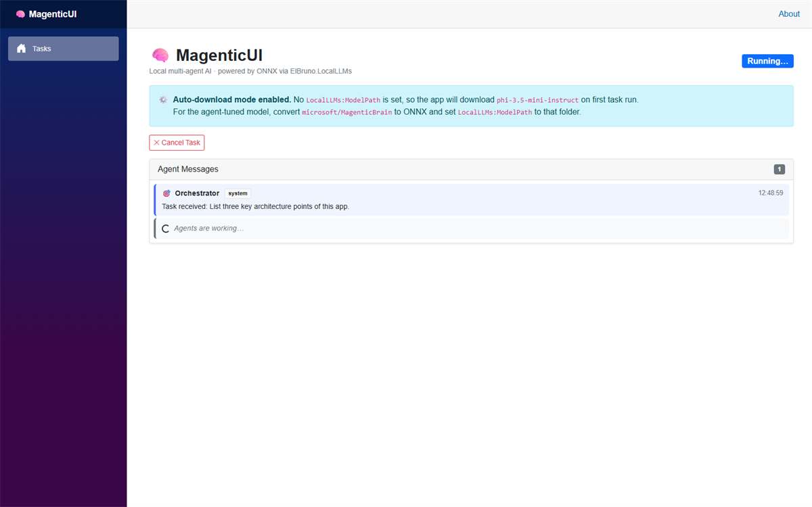
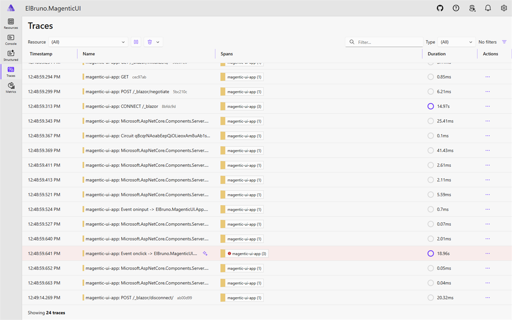

# Building a local-first Magentic UI in .NET with ElBruno.LocalLLMs

If you are a C# developer and want an agentic app without jumping to Python stacks, this sample is for you.

`ElBruno.MagenticUI` is a Blazor Server port of the original [microsoft/magentic-ui](https://github.com/microsoft/magentic-ui), using [ElBruno.LocalLLMs](https://github.com/elbruno/ElBruno.LocalLLMs) for local ONNX inference.

## Suggested titles (Magentic + Aspire angle)

- Magentic UI for .NET: local-first agents powered by Aspire
- From Magentic UI to Blazor: agentic workflows with ElBruno.LocalLLMs + Aspire
- C# Agentic UX: Magentic-style orchestration, local ONNX, and Aspire observability
- Building a .NET Magentic app with Aspire, GenAI traces, and human-in-the-loop

## Why this sample matters for .NET teams

- **Local-first:** run inference on your machine with ONNX Runtime GenAI.
- **Human-in-the-loop:** orchestrator can pause and request user input.
- **Blazor Server UX:** no React/Node/npm required.
- **Production-friendly structure:** App, Agents, and model runtime are separated cleanly.
- **Aspire orchestration and observability:** run the app and inspect traces/health in one place.



## The Microsoft research context behind this architecture

This repository aligns with the direction described in:

- [Fara 1.5: A New Frontier for Computer-Use AI Agents](https://www.microsoft.com/en-us/research/articles/fara1-5-computer-use-agent/)
- [MagenticLite, MagenticBrain, Fara1.5: An agentic experience optimized for small models](https://www.microsoft.com/en-us/research/blog/magenticlite-magenticbrain-fara1-5-an-agentic-experience-optimized-for-small-models/)

The diagram below (from the Microsoft Research blog above) explains the relationship between MagenticLite, MagenticBrain, and Fara1.5.



## Powered by Aspire: orchestration + GenAI tracing

The solution is orchestrated with **Aspire** (`ElBruno.MagenticUI.AppHost`).  
This gives you an operational view of the app while it runs, and makes troubleshooting much easier.

Running app screenshot:



Aspire dashboard trace view (including GenAI telemetry emitted by the app):



## C# code: download and use MagenticBrain with ElBruno.LocalLLMs

For agentic orchestration scenarios, you can use `KnownModels.MagenticBrain` and let the library handle first-run download.

```csharp
using ElBruno.LocalLLMs;
using Microsoft.Extensions.AI;

var options = new LocalLLMsOptions
{
    Model = KnownModels.MagenticBrain,
    EnsureModelDownloaded = true,
    ExecutionProvider = ExecutionProvider.Cpu
};

using var client = await LocalChatClient.CreateAsync(
    options,
    progress: new Progress<ModelDownloadProgress>(p =>
    {
        var percent = (p.BytesDownloaded * 100d) / p.TotalBytes;
        Console.WriteLine($"{p.FileName}: {percent:F1}%");
    }));

var response = await client.GetResponseAsync([
    new(ChatRole.User, "Summarize the architecture of this repository in 3 bullets.")
]);

Console.WriteLine(response.Text);
```

## C# code: use Fara 1.5 with ElBruno.LocalLLMs

Fara is a vision-language model. Today it requires ONNX conversion first, then you point `ModelPath` to the converted folder and use `LocalVisionChatClient`.

One-time download + conversion call (PowerShell):

```powershell
hf download microsoft/Fara1.5-9B --local-dir ".\fara-pytorch"

python -m onnxruntime_genai.models.builder `
  -m ".\fara-pytorch" `
  --model_type qwen_vl `
  -o ".\models\fara-onnx-int4" `
  --precision int4
```

After that, your app stays fully in .NET:

```csharp
using ElBruno.LocalLLMs;
using Microsoft.Extensions.AI;

var options = new LocalLLMsOptions
{
    Model = KnownModels.Fara15_9B,
    ModelPath = @".\models\fara-onnx-int4", // converted ONNX folder
    MaxSequenceLength = 4096,
    Temperature = 0.1f
};

await using var client = new LocalVisionChatClient(options);

var messages = new List<ChatMessage>
{
    new(ChatRole.User, "Describe the interactive elements in this screenshot.")
};

var vision = new VisionChatOptions
{
    ImagePaths = [@".\sample-ui.png"]
};

await foreach (var token in client.GetStreamingResponseAsync(messages, vision))
{
    Console.Write(token.Text);
}
```

For the conversion workflow and constraints, see:
- `ElBruno.LocalLLMs` Fara conversion guide: `docs/onnx-conversion-fara.md`

## Run this sample

```bash
aspire start
```

```bash
dotnet build ElBruno.MagenticUI.slnx -v minimal
dotnet test ElBruno.MagenticUI.slnx -v minimal
```

## Final note

If your world is C#, this sample gives you a practical path to experiment with local multi-agent UX in pure .NET: Blazor + ElBruno.LocalLLMs + ONNX Runtime GenAI.
