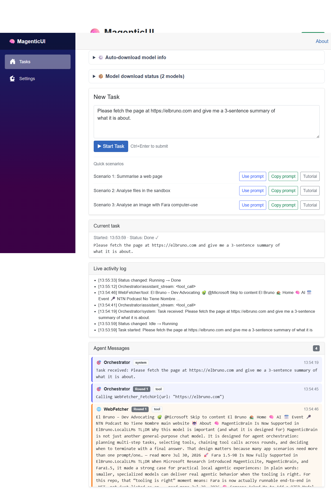
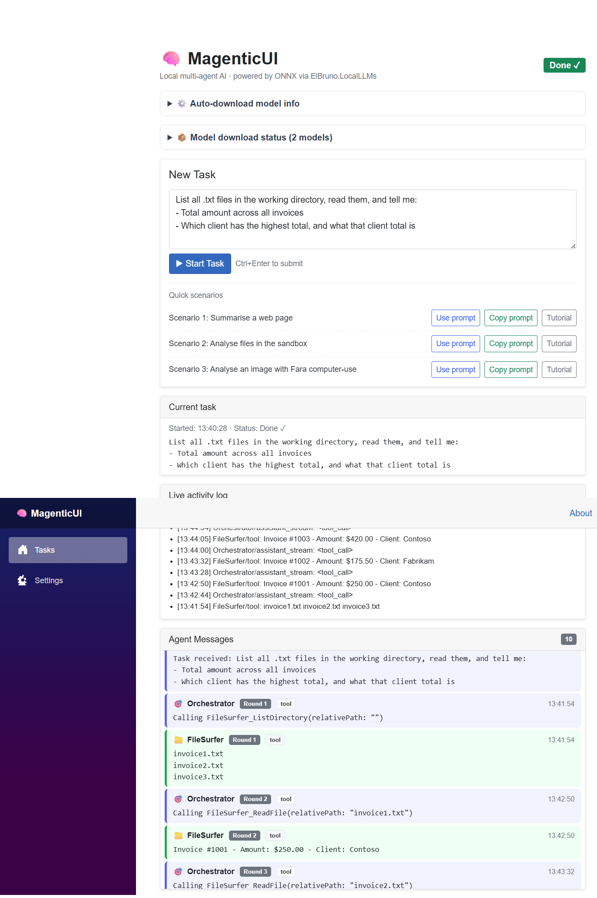
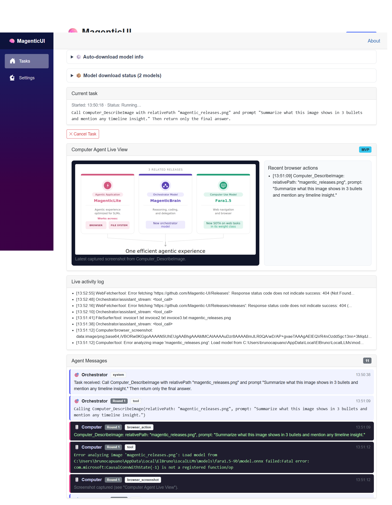

# ElBruno.MagenticUI — Getting Started Tutorial

This guide walks you through three end-to-end scenarios after you launch the app with
`aspire start`.

---

## Prerequisites

| Requirement | Notes |
|-------------|-------|
| .NET 10 SDK | https://dotnet.microsoft.com/download |
| Aspire CLI | `dotnet tool install -g Aspire.Cli` |
| Windows x64 | Required for CPU/DirectML ONNX inference |
| ~4+ GB free disk space | Depends on the selected model download |

> **GPU / DirectML optional.** The app auto-falls-back to CPU if DirectML or CUDA is
> unavailable. Inference on CPU is slower but fully functional.

---

## Launch the app

```powershell
# From the repo root
aspire start
```

Aspire prints two URLs:

```
Dashboard: https://localhost:17175/login?t=<token>
App:       https://localhost:7127
```

Open the **App URL** (`https://localhost:7127`) in your browser. The MagenticUI panel
appears immediately.

**First run only:** If model paths are empty in `appsettings.json`
(`LocalLLMs:Models:Orchestrator:ModelPath` and `LocalLLMs:Models:ComputerUse:ModelPath`),
the app auto-downloads configured model IDs to
`%LOCALAPPDATA%\ElBruno\LocalLLMs\models\` the first time you submit a task. This takes
a few minutes depending on your connection and model size; progress is logged to the
Aspire dashboard.

---

## Tasks + Settings pages

Use the left navigation menu:

- **Tasks** — submit prompts, review agent output, and see real-time model download
  progress while a task is running.
- **Settings** — manage local model storage and per-role model status.

In **Settings**, each model card shows:

- **Present/Missing** badge for local availability
- **Download phase** (`Idle`, `Downloading`, `Completed`, `Failed`)
- **Download model** button to fetch missing models immediately
- **Effective model path** and status text
- **Open folder** button to open the model location in your OS file explorer
- **Delete model** button with **Confirm delete** / **Cancel** safety prompt

Delete is blocked while a model is actively downloading.

Runtime controls in **Settings** also include:

- **Max rounds** (orchestration loop cap)
- **Task timeout (seconds)** (`0` disables timeout)
- **Max output tokens** (limits per-response generation size)

> Tip: if local responses feel slow, reduce **Max output tokens** first.

---

## Aspire Dashboard

The dashboard at `https://localhost:17175` gives you:

- **Traces** — every agent round shows as a span tree
- **Logs** — real-time structured logs from all services
- **Metrics** — request counts, latencies, health

Use it to inspect what each agent is doing internally while your task runs.

---

## Scenario 1 — Summarise a Web Page

**Goal:** Ask the orchestrator to fetch a URL and return a concise summary.

### Steps

1. Open `https://localhost:7127`
2. In the **task input** box, type:
   ```
   Please fetch the page at https://elbruno.com and give me a 3-sentence summary of
   what it is about.
   ```
3. Click **Start Task** (or press **Ctrl + Enter**)
4. Watch the live message feed:
   - 🔵 **Orchestrator** — decides to call `WebFetcher_FetchUrl`
   - 🟢 **WebFetcher** — fetches the URL and returns HTML/Markdown
   - 🔵 **Orchestrator** — synthesises the summary
   - 🟣 **Submit** message — task complete

5. The final answer appears in the feed labelled `submit`.

During first-run model fetches, the **Tasks** page also shows:

- active per-model progress bars with file/byte progress
- short completion/failure notices when downloads finish

If you click **Cancel Task**, status changes to **Cancelling…** while in-flight model work is
being interrupted, then transitions when cancellation completes.

### What to expect

Depending on model speed (CPU ~30-60 s per round, DirectML ~5-10 s), the task
completes in 2-4 rounds. The feed updates in real time.

With `ExecutionProvider: Auto` (default), the runtime attempts GPU acceleration first when
available, and falls back to CPU automatically when provider dependencies are missing.

### Screenshot (validated)



Expected completion signals:

- Status changes to **Done ✓**
- A `WebFetcher_FetchUrl` tool call appears in the feed
- Final `submit` message returns a 3-sentence summary of the target page

### Try variations

- `Summarise https://github.com/microsoft/magentic-ui/blob/main/README.md`
- `What is the latest news on https://news.ycombinator.com ? Give me the top 5 stories.`

---

## Scenario 2 — Analyse Files in a Sandbox Directory

**Goal:** Have the orchestrator list, read, and reason about files you place in the
working directory.

### Steps

1. Create a sandbox folder and drop some text files in it:
   ```powershell
   $sandbox = "$env:TEMP\magentic-sandbox"
   New-Item $sandbox -ItemType Directory -Force
   "Invoice #1001 - Amount: $250.00 - Client: Contoso" | Set-Content "$sandbox\invoice1.txt"
   "Invoice #1002 - Amount: $175.50 - Client: Fabrikam" | Set-Content "$sandbox\invoice2.txt"
   "Invoice #1003 - Amount: $420.00 - Client: Contoso" | Set-Content "$sandbox\invoice3.txt"
   ```

2. Open `https://localhost:7127`
3. Type this task:
   ```
   List all .txt files in the working directory, read them, and tell me:
   - Total amount across all invoices
   - Which client has the highest total, and what that client total is
   ```
4. Click **Start Task**
5. Watch the feed:
   - 🔵 **Orchestrator** — calls `FileSurfer_ListDirectory`
   - 🟠 **FileSurfer** — returns `invoice1.txt`, `invoice2.txt`, `invoice3.txt`
   - 🔵 **Orchestrator** — calls `FileSurfer_ReadFile` for each
   - 🟠 **FileSurfer** — returns file contents
   - 🔵 **Orchestrator** — calculates totals, calls `Submit`

6. Answer: total $845.50, Contoso has $670.00.

### What to expect

FileSurfer is sandboxed to `LocalLLMs:WorkingDirectory` (defaults to
`%TEMP%\magentic-sandbox`). It cannot read outside that directory.

### Screenshot (validated)



Expected completion signals:

- Status changes to **Done ✓**
- Tool sequence includes `FileSurfer_ListDirectory` and multiple `FileSurfer_ReadFile`
- Final `submit` contains the computed totals

For the sample invoice data above, expected result is:

- **Total amount:** `$845.50`
- **Highest client total:** `Contoso ($670.00)`

### Try variations

- Drop a CSV or JSON file and ask for specific data extraction
- Ask the orchestrator to write a summary file back: `Save the total as summary.txt`
  (uses `FileSurfer_WriteFile`)

---

## Scenario 3 — Analyse an Image with Fara Computer-Use

**Goal:** Use `Coder_ExecuteCode` to download an image, then use
`Computer_DescribeImage` (Fara model) to analyze it.

### Steps

1. Open `https://localhost:7127`
2. In the **task input** box, paste:
   ```
   Use Coder_ExecuteCode to download https://raw.githubusercontent.com/elbruno/ElBruno.MagenticUI/master/images/magentic_releases.png into the working directory as magentic_releases.png.
   Then call Computer_DescribeImage with:
   - relativePath: magentic_releases.png
   - prompt: "Summarize what this image shows in 3 bullets and mention any timeline insight."
   Return only the final answer.
   ```
3. Click **Start Task**
4. Watch the feed:
   - 🔵 **Orchestrator** plans the steps
   - 💻 **Coder** runs Python to download the image
   - 🖱️ **Computer** analyzes the image through the Fara computer-use model
   - 🔵 **Orchestrator** formats the findings and submits the answer

### What to expect

You should get a visual summary grounded in the screenshot content, produced by the
computer-use model instead of manual PNG header parsing.

### Screenshot (current observed behavior)



Expected behavior when environment is fully compatible:

- `Coder_ExecuteCode` (or equivalent file preparation) provides `magentic_releases.png`
- `Computer_DescribeImage` runs with the Fara model
- Orchestrator emits a final `submit` with a 3-bullet image summary

Current validated behavior in this environment (Windows, this run):

- `Computer_DescribeImage` is invoked and a live screenshot is captured in **Computer Agent Live View**
- Fara model load/inference fails with:
   - `com.microsoft:CausalConvWithState(-1) is not a registered function/op`
- Orchestrator may continue fallback attempts (for example, additional web fetches) and can remain in **Running…**

---

## Scenario 3 — Fara Visual Grounding (Prediction Only)

**Goal:** Use a screenshot and a safe goal to preview the next computer-use action
without allowing the app to operate a browser.

### Setup

Configure the Fara1.5-9B model in
`src/ElBruno.MagenticUI.App/appsettings.json` (or use the model settings exposed by
the app):

```json
"LocalLLMs": {
  "FaraVision": {
    "ModelPath": "C:\\Models\\Fara1.5-9B"
  }
}
```

With `ElBruno.LocalLLMs` 0.20.9, Fara auto-downloads the published multimodal ONNX
package to the LocalLLMs cache on first prediction. You can still set `ModelPath` to
use a local conversion instead.
See [fara-onnx-setup.md](fara-onnx-setup.md) for conversion steps.

The model directory must already contain the extracted ONNX model. Do not store model
files in the repository; they are several gigabytes. Restart the app after changing
the model path.

### Safe example

1. Open **Fara Visual Grounding** at
   `https://localhost:7127/fara-visual-grounding`.
2. Under **Ready-to-use samples**, select **Shopping cart** or **GitHub issue**.
   Each sample includes a safe goal and shows its dimensions. You can still upload
   your own PNG, JPEG, or WebP screenshot at any time.
3. To use a sample, select one and review the prefilled goal:
   ```
   Locate the Proceed To Checkout button, but do not click it.
   ```
4. Click **Predict action**. The sample remains available as a static asset, while
   uploads continue to be handled independently.

The result shows the typed action (for example `left_click`) and its predicted
coordinates, together with a marker over the screenshot. The marker is scaled to the
displayed image even when the browser resizes it. The raw model response is available
in the diagnostics section.

> **Safety boundary:** This page performs prediction and visualization only. It never
> clicks, types, submits forms, sends messages, visits URLs, or otherwise controls a
> real browser. A future sandboxed executor must add explicit approval before any
> external action.

If the model returns a malformed or unsupported action, the page reports the parsing
error and leaves the last successful result visible.

---

## Additional Guides

- [Human-in-the-Loop](./tutorial-human-in-the-loop.md)
- [Scenario Playbooks (P1)](./tutorial-scenario-playbooks.md)
- [Configuring a Different Model](./tutorial-model-configuration.md)
- [Troubleshooting](./tutorial-troubleshooting.md)
- [Native DLL Note](./tutorial-native-dll-note.md)
- [Upstream Scenario Coverage](./upstream-scenario-coverage.md)
